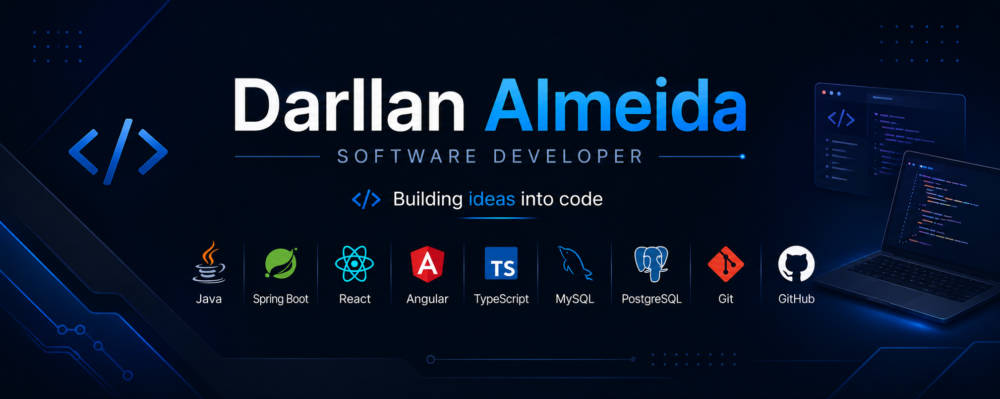

# Hi there, I'm Darllan 👋

💻 **Software Developer** | Passionate about learning and building real-world solutions

I'm a **detail-oriented and curious Software Developer** focused on building modern web applications and solving real-world problems.

My main focus is **Java and Spring Boot** for backend development, combined with **React and Angular** for frontend applications.

I enjoy turning ideas into functional software, learning new technologies and continuously improving my development skills.

---

## 🚀 About Me

- 💻 Focused on **Software & Full Stack Development**
- ☕ Backend development with **Java & Spring Boot**
- ⚛️ Frontend development with **React & Angular**
- 🌐 Building and consuming **REST APIs**
- 🗄️ Working with **MySQL and PostgreSQL**
- 🔧 Using **Git and GitHub** for version control
- 📚 Always learning and improving
- 🤝 Interested in collaborating on software projects

---

## 🔭 What I'm Currently Working On

- Improving my **Software Development skills**
- Building real-world applications
- Strengthening my knowledge of **Java & Spring Boot**
- Developing frontend applications with **React & Angular**
- Learning more about **software architecture and best practices**

---

## 💼 Featured Projects

### 👟 KickZone

Full Stack e-commerce application focused on sports footwear.

**Technologies:**

☕ Java  
🌱 Spring Boot  
🅰️ Angular  
🗄️ MySQL  
🌐 REST API  
💻 JavaScript  
🎨 HTML & CSS

🔗 [View Repository](https://github.com/DarllanAlmeida/ecommerce-fullstack)

---

### 🌤️ Clima360

Full Stack weather application that allows users to search for weather information by city using a weather API.

**Technologies:**

☕ Java 17  
🌱 Spring Boot  
⚡ Spring WebFlux  
⚛️ React  
💻 JavaScript  
🎨 CSS3  
🌐 REST API  
🌤️ OpenWeather API

🔗 [View Repository](https://github.com/DarllanAlmeida/Clima360)

---

## 🛠️ Tech Stack

### 💻 Languages

☕ Java  
💻 JavaScript  
📘 TypeScript  
🌐 HTML5  
🎨 CSS3

### ⚙️ Backend

🌱 Spring Boot  
⚡ Spring WebFlux  
🌐 REST APIs

### 🎨 Frontend

⚛️ React  
🅰️ Angular

### 🗄️ Databases

🐬 MySQL  
🐘 PostgreSQL

### 🔧 Tools

🔀 Git  
🐙 GitHub  
💻 VS Code

---

## 🌐 Connect With Me

🌐 **Portfolio**

https://darllanalmeida.github.io/portfolio/

💼 **LinkedIn**

https://www.linkedin.com/in/darllan-almeida-695a54275/

📧 **Email**

darllanmathers50@gmail.com

---

## 💬 Ask Me About

Java, Spring Boot, React, Angular, JavaScript, REST APIs, MySQL, PostgreSQL and software development.

---

## ⚡ Fun Fact

I love playing 🎹 piano, 🎸 guitar, 🎮 video games and listening to 🎵 music.

---

## 📊 GitHub

💻 Check out my repositories to explore my projects, technologies and development journey.

⭐ Feel free to explore, give feedback or connect with me!

