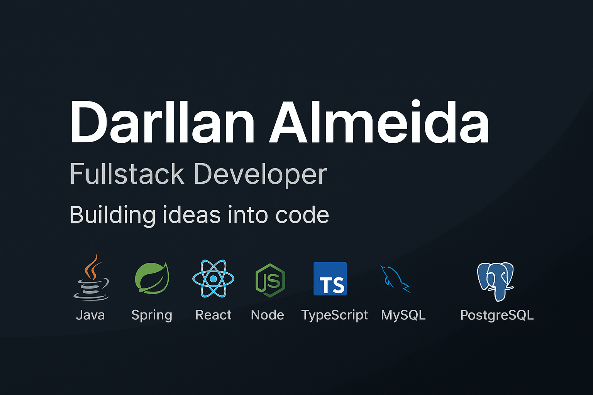

# Hi there, I'm Darllan 👋  

💻 **Fullstack Developer** | 🌱 Passionate about learning & building real-world solutions  

I’m a **detail-oriented and curious developer** specialized in **Java & Spring Boot** for backend development and **React** for frontend.  
I also have strong experience with **Node.js, TypeScript, and modern web technologies** to deliver robust and scalable applications.  

I love teamwork 🤝, sharing knowledge, and constantly learning new technologies to improve my craft.  

---

## 🔭 What I’m currently working on
- Enhancing my **fullstack development skills**  
- Building and contributing to **open-source projects**  
- Exploring **cloud technologies & microservices**  

---

## 👯 I’m looking to collaborate on
- **Fullstack projects** (React + Node.js / Spring Boot)  
- **Backend systems** with Java & Spring  
- **Frontend apps** with React & TypeScript  

---

  
 💬 Ask me about:
 
Java, SpringBoot, Javascript, React, HTML, CSS, Mysql, and any general software development questions.

  
⚡ Fun fact:

I love playing piano, guitar, video games and listen to music.

## 🌐 Socials:

## 💻 Tech Stack:
  
  
  
  
  
  
  
  

### 🛠 Tools & Databases  
  
  
  
  
  

---

## 📊 GitHub Stats:

